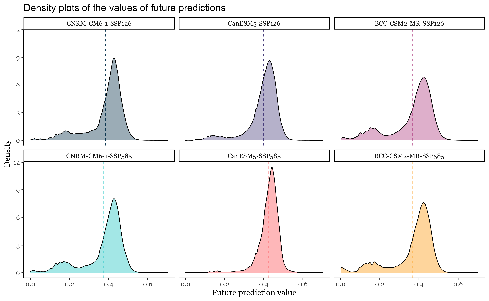

# Maps-visualisation-R

This short visualisation code helps to get multiple maps visualised in one plot which makes it easier to compare results.
To convert raster data to subplotted image the following libraries are used:

* ggplot2
* ggpubr
* data.table
* dplyr
* raster
* sp

Maps visualised

 
  

 
  

